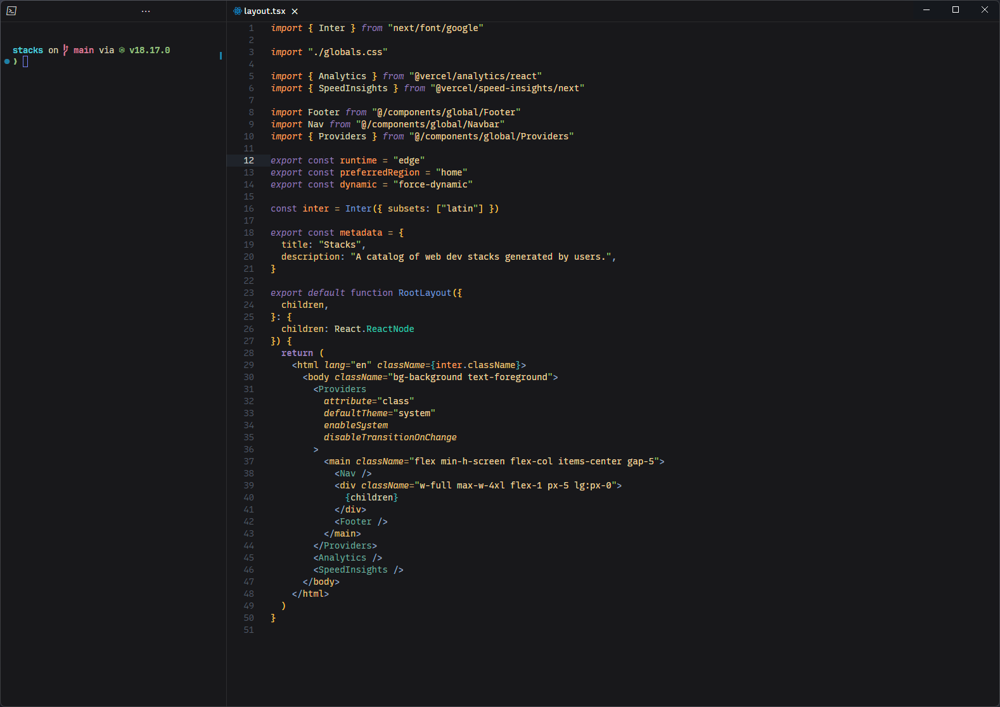

# Ronin

A relaxing dark theme inspired by Kanagawa.

## Installation

1. Download the .vsix file from releases
2. Open vscode command palette (shift+ctrl/cmd+P) and search "install from vsix"
3. Select the .vsix file you downloaded
4. Set Ronin as your color theme
